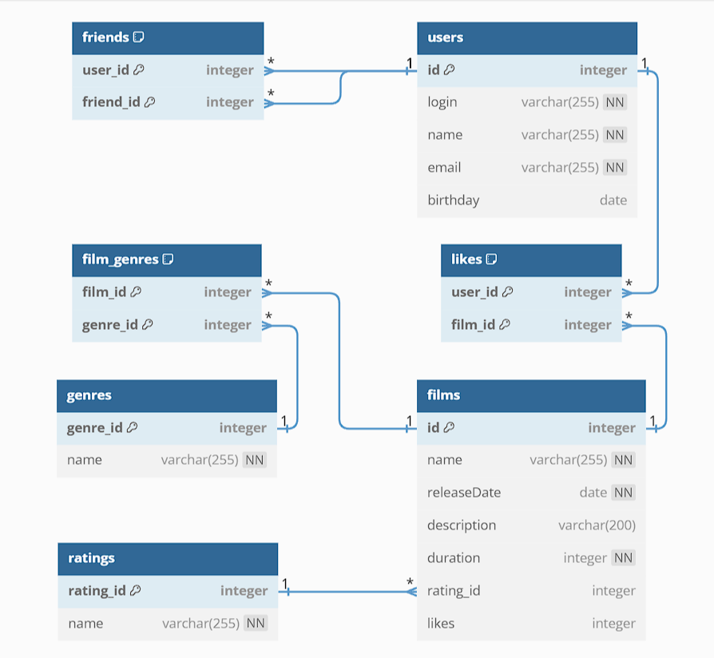

# java-filmorate
Это приложение предназначено для возврата, рекомендованных к просмотру, фильмов.   
Функциональность:   
- Добавление и обнавление фильмов
- Добавление и обновление пользователей
- Получение списков всех фильмов и всех пользователей
- Получение фильмов и пользователей по ид
- Добавление и удаление пользователей друг друга в друзья
- Получение списков индивидуальных и общих друзей
- Добавление и удаление пользователями лайков к фильмам
- Получение списка (разного размера) популярных фильмов 
- Получение самого популярного фильма

## Схема базы данных

### Пояснение к схеме
Основная взаимосвязь между таблицами осуществляется через идентефикаторы (id). 
Таблица users связана с таблицей films по принципу «многие ко многим» через дополнительную таблицу likes.
Аналогичным образом осуществлена связь между genres и films через film_genres.

### Тестирование
Для запуска тестов необходимо в файле **application.properties** изменить настройку сохранения базы данных.
Сейчас база сохраняется в файл:   
**spring.datasource.url=jdbc:h2:file:./db/filmorate**  
Нужно сохранять в памяти:   
**spring.datasource.url=jdbc:h2:mem:filmorate**
