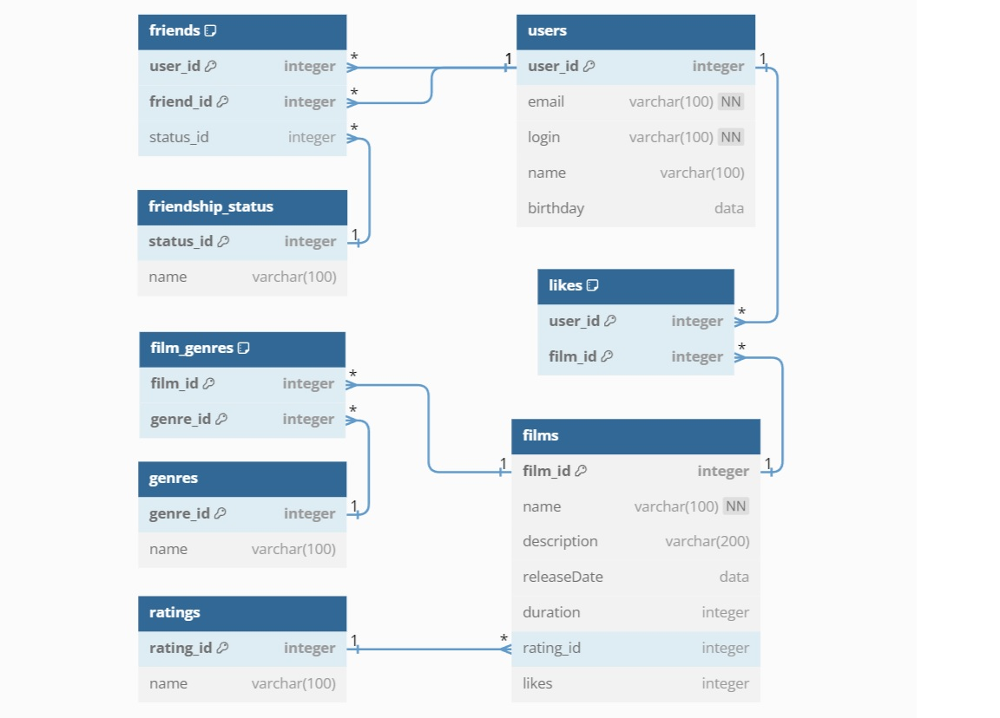

# java-filmorate
Хранилище для проекта Fillmore.

## Схема базы данных

### Пояснение к схеме
Основная взаимосвязь между таблицами осуществляется через идентефикаторы (id). 
Таблица users связана с таблицей films по принципу «многие ко многим» через дополнительную таблицу likes.
Аналогичным образом осуществлена связь между genres и films через film_genres.
#### Дружба
Функционал "Дружбы" и присвоения статуса этой дружбе осуществлён с помощью 2-х дополнительных таблиц.
Таблица friendship_status хранит идентификаторы и названия статусов дружбы. Связь с таблицей friends - «один ко многим».
Таблица friends хранит идентификаторы пользователя и его друга, а так же статуса их дружбы. 
Идентификаторы пользователя и его друга связаны с user_id из таблицы users по принципу «многие к одному».
